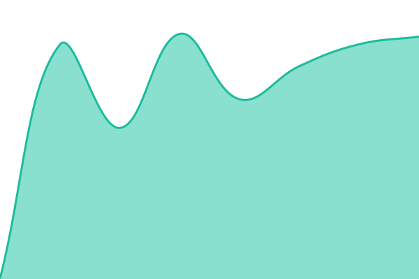
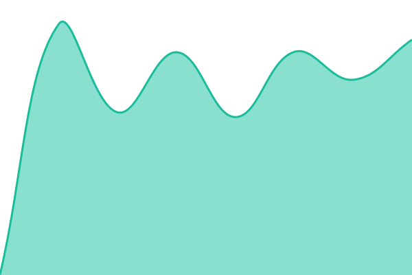
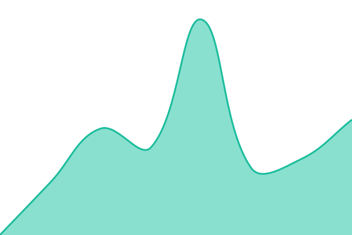
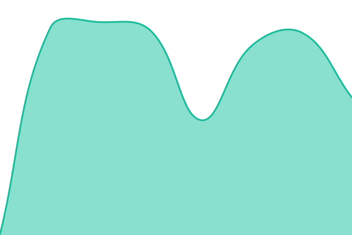
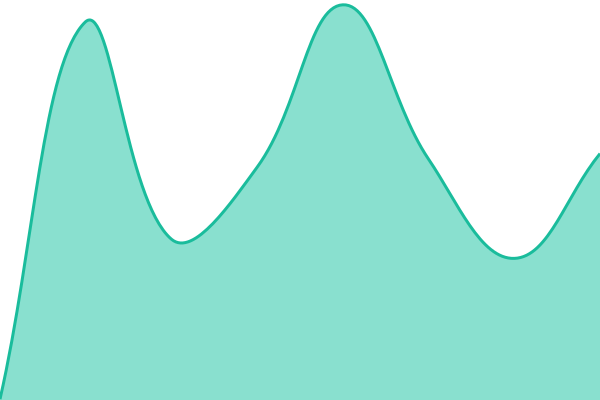

# État des services 2gather

**État courant : <!--live status--> **Tous les services sont opérationnels\*\*

Ce dépôt mesure la disponibilité des services 2gather. Les points d'entrée sont interrogés depuis
les runners GitHub Actions, donc depuis l'extérieur de l'infrastructure surveillée. Chaque mesure
est ajoutée à l'historique du dépôt, jamais réécrite.

[Page de statut](https://2gather-platform.github.io/2gather-status/) ·
[Historique des relevés](https://github.com/2gather-platform/2gather-status/commits/main)

## Ce qui est surveillé

| Service                    | Ce que la sonde vérifie                                |
| -------------------------- | ------------------------------------------------------ |
| API                        | le processus répond, sans toucher la base ni le cache  |
| API, accès base de données | une lecture aboutit réellement en base                 |
| Domaine principal          | le domaine que l'application déclare comme le sien     |
| Liens universels           | le fichier qui autorise un lien partagé à ouvrir l'app |
| Application web événements | la page répond et rend l'interface                     |
| Application web profils    | la page répond et rend l'interface                     |
| Administration, production | la console répond et rend l'interface                  |
| Administration, événements | la console répond et rend l'interface                  |
| Administration, profils    | le portail d'accès répond, pas la console derrière     |

**Deux sondes portent sur le domaine principal, et elles ne font pas double emploi.** Le domaine
peut répondre alors que `/.well-known/` reste introuvable : servir une application et servir ce
répertoire sont deux règles distinctes. Une seule sonde sur la racine déclarerait résolu un
problème qui ne le serait pas.

Ce répertoire porte le fichier que le système d'exploitation va chercher pour autoriser un lien
partagé à ouvrir l'application plutôt que le navigateur. Son absence ne produit aucune erreur
visible : elle dégrade chaque lien partagé en silence, ce qui est précisément pourquoi elle mérite
sa propre mesure. La plateforme mobile qui n'a pas encore son fichier équivalent n'est donc pas
couverte par cette sonde, et son état ne se déduit pas de celui-ci.

**Deux sondes portent sur l'API, et c'est délibéré.** La première répond un statut constant sans
interroger la base : elle reste verte quand PostgreSQL est tombé. La seconde lit réellement en base,
bornée à un seul enregistrement. Les deux ensemble distinguent un processus mort d'une base morte.
Sur l'une comme sur l'autre le contenu de la réponse est vérifié, donc un code 200 qui rendrait un
corps vide compte comme indisponible.

**Seules les adresses sans enjeu sont publiées.** La sonde de vie de l'API et les deux applications
web sont affichées en clair : elles ne rendent rien qu'un visiteur ne puisse déjà voir. La sonde de
lecture en base et les trois consoles d'administration passent par des secrets de dépôt, référencés
par leur nom dans la configuration. Leur état est public, leur adresse ne l'est pas. Upptime écrit
le nom du secret dans `history/`, jamais sa valeur, et n'affiche aucun lien pour ces services.

**Le contenu de la réponse est vérifié partout, pas seulement le code HTTP.** Upptime accepte par
défaut tout code de 200 à 308 et suit les redirections. Sans marqueur de contenu, un service qui
redirige vers une page d'erreur, ou qui rend une coquille vide en 200, passerait pour opérationnel.
Chaque sonde exige donc une chaîne attendue dans le corps. Le marqueur est une marque de
l'interface, pas un fragment de mise en page, pour ne pas virer au rouge au premier changement de
gabarit.

**Une sonde mesure moins que son nom ne le suggère, et le dit.** La console des profils est derrière
un portail d'authentification qui répond à sa place : la sonde reçoit la page de connexion du
portail, jamais la console. Elle vérifie que le nom résout, que TLS s'établit et que le portail
sert la demande. La console derrière peut être tombée sans que cet état bouge. Aller plus loin
suppose un jeton de service du portail, passé en en-tête depuis un secret de dépôt.

**Les applications mobiles ne figurent pas ici.** Elles ne s'interrogent pas en HTTP et dépendent de
l'API ci-dessus. Leur taux de sessions sans plantage se mesure avec un outil distinct.

## Comment lire les états

- 🟩 **Opérationnel** : la sonde répond, dans le budget de temps de réponse.
- 🟨 **Dégradé** : la sonde répond mais dépasse `maxResponseTime`. Le seuil est fixé par service,
  entre 2 s et 4 s, à environ trois fois la latence mesurée sur ce service depuis un runner. Un
  seuil unique aurait été soit aveugle sur les points d'entrée rapides, soit en dégradé permanent
  sur le plus lent. Ces valeurs reposent sur peu de relevés : elles seront à revoir après une
  semaine, contre les percentiles réels de `api/*/response-time-week.json`.
- 🟥 **Indisponible** : la sonde ne répond pas, renvoie un code d'erreur, ou rend un corps qui ne
  contient pas le marqueur attendu.

Une interruption ouvre une issue datée, assignée, close au rétablissement. `skipDeleteIssues` est
activé : sans ce réglage Upptime supprime les issues refermées en moins de quinze minutes, ce qui
efface justement les incidents courts, les plus fréquents.

## Le délai de détection, mesuré

**Le relevé est demandé toutes les cinq minutes. Il ne l'est pas.** Sur 28 exécutions planifiées
consécutives, mesurées le 2026-08-17 sur seize heures, l'intervalle réel va de 16 à 84 minutes,
avec une médiane de 29 et une moyenne de 36. GitHub retarde les tâches planifiées sous charge et
le documente : « le début de chaque heure fait partie des périodes de forte charge, et certaines
exécutions en file peuvent être abandonnées ». Aucun réglage du dépôt ne change cela.

Un écart de 84 minutes ne s'explique pas par un retard seul : c'est un déclenchement abandonné,
le second comportement décrit par la documentation. Ces mesures doivent être refaites
périodiquement, la charge de GitHub n'étant pas une constante.

La conséquence se dit en une phrase : **une interruption plus courte que l'intervalle peut ne
jamais être vue.** Un service tombé vingt minutes a de bonnes chances de ne laisser aucune trace
ici. Ce que ce moniteur mesure de façon fiable, ce sont les pannes qui durent, pas les
micro-coupures. Un chiffre de disponibilité mensuel calculé sur cette base est donc un plancher,
jamais une garantie.

Deux choses ont été faites avec ce qui est sous contrôle. Les crons sont décalés du début d'heure,
ce que la documentation GitHub recommande explicitement pour réduire le retard. Et ils évitent la
grille des relevés, toutes les tâches Upptime partageant un même groupe de concurrence où deux
déclenchements simultanés se mettent en file.

Descendre réellement sous les cinq minutes suppose de sortir du planificateur de GitHub. Les
workflows acceptent déjà `repository_dispatch`, il ne manque qu'un ordonnanceur qui tienne la
cadence, sur une machine déjà en service :

```bash
curl -X POST https://api.github.com/repos/2gather-platform/2gather-status/dispatches \
  -H "Authorization: Bearer $GH_PAT" \
  -H "Accept: application/vnd.github+json" \
  -d '{"event_type":"uptime"}'
```

Une entrée cron toutes les cinq minutes suffit. Le jeton demande la portée `contents: write` sur
ce dépôt uniquement. À faire seulement si le délai de détection actuel est jugé trop long : cela
introduit une dépendance à une machine, ce que le tout-GitHub évitait.

## Les workflows sont durcis à la main

Les fichiers de `.github/workflows/` portent trois choses que les gabarits d'Upptime ne génèrent
pas : un `timeout-minutes`, un bloc `permissions` au strict nécessaire, et des actions épinglées
sur une version plutôt que sur `master`.

Sans `timeout-minutes`, le défaut de GitHub est de six heures alors que ces tâches durent moins de
deux minutes. Toutes partagent un groupe de concurrence en `cancel-in-progress: false`, donc un job
bloqué met en file tous les relevés suivants : le moniteur deviendrait aveugle sans que rien ne le
signale. Sans bloc `permissions`, chaque tâche reçoit le jeton par défaut du dépôt, en écriture sur
toutes les portées.

**`Update Template CI` annule ce durcissement.** Elle supprime puis régénère les huit fichiers
depuis les gabarits amont, qui n'en portent rien. Les crons survivent, puisqu'ils sont relus depuis
`workflowSchedule`. Le reste est perdu, et `setup.yml` réapparaît. Après l'avoir lancée, vérifier :

```bash
grep -L "timeout-minutes" .github/workflows/*.yml   # doit ne rien lister
```

<!--start: status pages-->
<!-- This summary is generated by Upptime (https://github.com/upptime/upptime) -->
<!-- Do not edit this manually, your changes will be overwritten -->
<!-- prettier-ignore -->
| URL | État | Historique | Temps de réponse | Disponibilité |
| --- | ------ | ------- | ------------- | ------ |
|  [API](https://api.2-gather.app/api/health) | 🟩 Opérationnel | [api.yml](https://github.com/2gather-platform/2gather-status/commits/HEAD/history/api.yml) | <details><summary> 531 ms</summary><br><a href="https://2gather-platform.github.io/2gather-status/history/api"></a><br><a href="https://2gather-platform.github.io/2gather-status/history/api"></a><br><a href="https://2gather-platform.github.io/2gather-status/history/api"></a><br><a href="https://2gather-platform.github.io/2gather-status/history/api"></a><br><a href="https://2gather-platform.github.io/2gather-status/history/api"></a></details> | <details><summary><a href="https://2gather-platform.github.io/2gather-status/history/api">100.00%</a></summary><a href="https://2gather-platform.github.io/2gather-status/history/api"></a><br><a href="https://2gather-platform.github.io/2gather-status/history/api"></a><br><a href="https://2gather-platform.github.io/2gather-status/history/api"></a><br><a href="https://2gather-platform.github.io/2gather-status/history/api"></a><br><a href="https://2gather-platform.github.io/2gather-status/history/api"></a></details>
|  API, accès base de données | 🟩 Opérationnel | [api-acces-base-de-donnees.yml](https://github.com/2gather-platform/2gather-status/commits/HEAD/history/api-acces-base-de-donnees.yml) | <details><summary> 534 ms</summary><br><a href="https://2gather-platform.github.io/2gather-status/history/api-acces-base-de-donnees"></a><br><a href="https://2gather-platform.github.io/2gather-status/history/api-acces-base-de-donnees"></a><br><a href="https://2gather-platform.github.io/2gather-status/history/api-acces-base-de-donnees"></a><br><a href="https://2gather-platform.github.io/2gather-status/history/api-acces-base-de-donnees"></a><br><a href="https://2gather-platform.github.io/2gather-status/history/api-acces-base-de-donnees"></a></details> | <details><summary><a href="https://2gather-platform.github.io/2gather-status/history/api-acces-base-de-donnees">100.00%</a></summary><a href="https://2gather-platform.github.io/2gather-status/history/api-acces-base-de-donnees"></a><br><a href="https://2gather-platform.github.io/2gather-status/history/api-acces-base-de-donnees"></a><br><a href="https://2gather-platform.github.io/2gather-status/history/api-acces-base-de-donnees"></a><br><a href="https://2gather-platform.github.io/2gather-status/history/api-acces-base-de-donnees"></a><br><a href="https://2gather-platform.github.io/2gather-status/history/api-acces-base-de-donnees"></a></details>
|  [Application web événements](https://2gather.events) | 🟩 Opérationnel | [application-web-evenements.yml](https://github.com/2gather-platform/2gather-status/commits/HEAD/history/application-web-evenements.yml) | <details><summary> 1071 ms</summary><br><a href="https://2gather-platform.github.io/2gather-status/history/application-web-evenements"></a><br><a href="https://2gather-platform.github.io/2gather-status/history/application-web-evenements"></a><br><a href="https://2gather-platform.github.io/2gather-status/history/application-web-evenements"></a><br><a href="https://2gather-platform.github.io/2gather-status/history/application-web-evenements"></a><br><a href="https://2gather-platform.github.io/2gather-status/history/application-web-evenements"></a></details> | <details><summary><a href="https://2gather-platform.github.io/2gather-status/history/application-web-evenements">100.00%</a></summary><a href="https://2gather-platform.github.io/2gather-status/history/application-web-evenements"></a><br><a href="https://2gather-platform.github.io/2gather-status/history/application-web-evenements"></a><br><a href="https://2gather-platform.github.io/2gather-status/history/application-web-evenements"></a><br><a href="https://2gather-platform.github.io/2gather-status/history/application-web-evenements"></a><br><a href="https://2gather-platform.github.io/2gather-status/history/application-web-evenements"></a></details>
|  [Application web profils](https://2gather.me) | 🟩 Opérationnel | [application-web-profils.yml](https://github.com/2gather-platform/2gather-status/commits/HEAD/history/application-web-profils.yml) | <details><summary> 505 ms</summary><br><a href="https://2gather-platform.github.io/2gather-status/history/application-web-profils"></a><br><a href="https://2gather-platform.github.io/2gather-status/history/application-web-profils"></a><br><a href="https://2gather-platform.github.io/2gather-status/history/application-web-profils"></a><br><a href="https://2gather-platform.github.io/2gather-status/history/application-web-profils"></a><br><a href="https://2gather-platform.github.io/2gather-status/history/application-web-profils"></a></details> | <details><summary><a href="https://2gather-platform.github.io/2gather-status/history/application-web-profils">100.00%</a></summary><a href="https://2gather-platform.github.io/2gather-status/history/application-web-profils"></a><br><a href="https://2gather-platform.github.io/2gather-status/history/application-web-profils"></a><br><a href="https://2gather-platform.github.io/2gather-status/history/application-web-profils"></a><br><a href="https://2gather-platform.github.io/2gather-status/history/application-web-profils"></a><br><a href="https://2gather-platform.github.io/2gather-status/history/application-web-profils"></a></details>
|  [Domaine principal](https://2-gather.app) | 🟩 Opérationnel | [domaine-principal.yml](https://github.com/2gather-platform/2gather-status/commits/HEAD/history/domaine-principal.yml) | <details><summary> 533 ms</summary><br><a href="https://2gather-platform.github.io/2gather-status/history/domaine-principal"></a><br><a href="https://2gather-platform.github.io/2gather-status/history/domaine-principal"></a><br><a href="https://2gather-platform.github.io/2gather-status/history/domaine-principal"></a><br><a href="https://2gather-platform.github.io/2gather-status/history/domaine-principal"></a><br><a href="https://2gather-platform.github.io/2gather-status/history/domaine-principal"></a></details> | <details><summary><a href="https://2gather-platform.github.io/2gather-status/history/domaine-principal">100.00%</a></summary><a href="https://2gather-platform.github.io/2gather-status/history/domaine-principal"></a><br><a href="https://2gather-platform.github.io/2gather-status/history/domaine-principal"></a><br><a href="https://2gather-platform.github.io/2gather-status/history/domaine-principal"></a><br><a href="https://2gather-platform.github.io/2gather-status/history/domaine-principal"></a><br><a href="https://2gather-platform.github.io/2gather-status/history/domaine-principal"></a></details>
|  [Liens universels des applications](https://2-gather.app/.well-known/apple-app-site-association) | 🟩 Opérationnel | [liens-universels.yml](https://github.com/2gather-platform/2gather-status/commits/HEAD/history/liens-universels.yml) | <details><summary> 442 ms</summary><br><a href="https://2gather-platform.github.io/2gather-status/history/liens-universels"></a><br><a href="https://2gather-platform.github.io/2gather-status/history/liens-universels"></a><br><a href="https://2gather-platform.github.io/2gather-status/history/liens-universels"></a><br><a href="https://2gather-platform.github.io/2gather-status/history/liens-universels"></a><br><a href="https://2gather-platform.github.io/2gather-status/history/liens-universels"></a></details> | <details><summary><a href="https://2gather-platform.github.io/2gather-status/history/liens-universels">100.00%</a></summary><a href="https://2gather-platform.github.io/2gather-status/history/liens-universels"></a><br><a href="https://2gather-platform.github.io/2gather-status/history/liens-universels"></a><br><a href="https://2gather-platform.github.io/2gather-status/history/liens-universels"></a><br><a href="https://2gather-platform.github.io/2gather-status/history/liens-universels"></a><br><a href="https://2gather-platform.github.io/2gather-status/history/liens-universels"></a></details>
|  Administration, production | 🟩 Opérationnel | [administration-production.yml](https://github.com/2gather-platform/2gather-status/commits/HEAD/history/administration-production.yml) | <details><summary> 450 ms</summary><br><a href="https://2gather-platform.github.io/2gather-status/history/administration-production"></a><br><a href="https://2gather-platform.github.io/2gather-status/history/administration-production"></a><br><a href="https://2gather-platform.github.io/2gather-status/history/administration-production"></a><br><a href="https://2gather-platform.github.io/2gather-status/history/administration-production"></a><br><a href="https://2gather-platform.github.io/2gather-status/history/administration-production"></a></details> | <details><summary><a href="https://2gather-platform.github.io/2gather-status/history/administration-production">100.00%</a></summary><a href="https://2gather-platform.github.io/2gather-status/history/administration-production"></a><br><a href="https://2gather-platform.github.io/2gather-status/history/administration-production"></a><br><a href="https://2gather-platform.github.io/2gather-status/history/administration-production"></a><br><a href="https://2gather-platform.github.io/2gather-status/history/administration-production"></a><br><a href="https://2gather-platform.github.io/2gather-status/history/administration-production"></a></details>
|  Administration, événements | 🟩 Opérationnel | [administration-evenements.yml](https://github.com/2gather-platform/2gather-status/commits/HEAD/history/administration-evenements.yml) | <details><summary> 1660 ms</summary><br><a href="https://2gather-platform.github.io/2gather-status/history/administration-evenements"></a><br><a href="https://2gather-platform.github.io/2gather-status/history/administration-evenements"></a><br><a href="https://2gather-platform.github.io/2gather-status/history/administration-evenements"></a><br><a href="https://2gather-platform.github.io/2gather-status/history/administration-evenements"></a><br><a href="https://2gather-platform.github.io/2gather-status/history/administration-evenements"></a></details> | <details><summary><a href="https://2gather-platform.github.io/2gather-status/history/administration-evenements">100.00%</a></summary><a href="https://2gather-platform.github.io/2gather-status/history/administration-evenements"></a><br><a href="https://2gather-platform.github.io/2gather-status/history/administration-evenements"></a><br><a href="https://2gather-platform.github.io/2gather-status/history/administration-evenements"></a><br><a href="https://2gather-platform.github.io/2gather-status/history/administration-evenements"></a><br><a href="https://2gather-platform.github.io/2gather-status/history/administration-evenements"></a></details>
|  Administration, profils (portail d'accès) | 🟩 Opérationnel | [administration-profils.yml](https://github.com/2gather-platform/2gather-status/commits/HEAD/history/administration-profils.yml) | <details><summary> 685 ms</summary><br><a href="https://2gather-platform.github.io/2gather-status/history/administration-profils"></a><br><a href="https://2gather-platform.github.io/2gather-status/history/administration-profils"></a><br><a href="https://2gather-platform.github.io/2gather-status/history/administration-profils"></a><br><a href="https://2gather-platform.github.io/2gather-status/history/administration-profils"></a><br><a href="https://2gather-platform.github.io/2gather-status/history/administration-profils"></a></details> | <details><summary><a href="https://2gather-platform.github.io/2gather-status/history/administration-profils">100.00%</a></summary><a href="https://2gather-platform.github.io/2gather-status/history/administration-profils"></a><br><a href="https://2gather-platform.github.io/2gather-status/history/administration-profils"></a><br><a href="https://2gather-platform.github.io/2gather-status/history/administration-profils"></a><br><a href="https://2gather-platform.github.io/2gather-status/history/administration-profils"></a><br><a href="https://2gather-platform.github.io/2gather-status/history/administration-profils"></a></details>

<!--end: status pages-->

[Voir la page de statut](https://2gather-platform.github.io/2gather-status/)

## Exploitation

Cinq workflows tournent seuls. `Uptime CI` relève l'état, aussi souvent que GitHub le lui accorde,
voir plus haut. `Response Time CI`, `Graphs CI`, `Static Site CI` et `Summary CI` reconstruisent des
vues à partir de l'historique, chacun une à quatre fois par jour. Le dépôt est public, donc les
minutes GitHub Actions ne sont pas décomptées du quota.

`Update Template CI` et `Updates CI` ne sont pas planifiés, ils se déclenchent à la main. Ces deux
tâches réécrivent des fichiers de workflow, ce que le jeton natif des Actions n'a pas le droit de
faire, quelle que soit la permission accordée au dépôt. Les lancer suppose un jeton personnel
à portée fine, stocké en secret `GH_PAT`, avec droit d'écriture sur Contents, Workflows et Issues.
Sans ce jeton elles échouent, et c'est pourquoi elles ne sont pas planifiées : un échec quotidien
dans un dépôt d'état est un mauvais signal.

### Secrets attendus

| Secret             | Rôle                                           |
| ------------------ | ---------------------------------------------- |
| `API_EVENTS_URL`   | sonde de lecture en base, bornée à un résultat |
| `ADMIN_APP_URL`    | console d'administration production            |
| `ADMIN_EVENTS_URL` | console d'administration événements            |
| `ADMIN_ME_URL`     | console d'administration profils               |

Tout nouveau secret doit être ajouté à la liste `secrets` de `.upptimerc.yml`. Cette liste est la
liste blanche complète : un secret absent n'est pas transmis aux workflows.

**Un secret absent, vide ou mal posé affiche le service comme mort.** La substitution laisse alors
la chaîne littérale, Upptime la préfixe en `https://$NOM_DU_SECRET`, et la résolution DNS échoue.
Le relevé porte `Could not resolve hostname`, une issue d'incident s'ouvre, et rien ne distingue ce
cas d'une vraie panne. Poser un secret avec `gh secret set NOM --body -` produit exactement cela :
la valeur devient le caractère `-`, car `--body` prend la valeur telle quelle et la lecture de
l'entrée standard demande d'omettre le drapeau.

```bash
printf '%s' 'https://exemple' | gh secret set NOM --repo 2gather-platform/2gather-status
```

Après avoir posé ou changé un secret, déclencher `Uptime CI` à la main et vérifier que le service
concerné remonte opérationnel, avant de laisser la mesure s'accumuler.

### Suivre les mises à jour

Trois canaux, du plus immédiat au plus complet.

| Canal               | Ce qu'il porte              | Comment                                                                                     |
| ------------------- | --------------------------- | ------------------------------------------------------------------------------------------- |
| Notification GitHub | les incidents, par courriel | suivre ce dépôt, ou être dans `assignees`                                                   |
| Flux Atom           | chaque relevé               | [`commits/main.atom`](https://github.com/2gather-platform/2gather-status/commits/main.atom) |
| Webhook temps réel  | les incidents, poussés      | secrets du fournisseur, voir ci-dessous                                                     |

Le flux Atom est volumineux par construction : il porte chaque relevé, pas seulement les incidents.
Pour une alerte poussée, Upptime accepte Slack, Discord, Telegram et le
webhook générique. Poser les secrets du fournisseur, par exemple `NOTIFICATION_SLACK` à `true` et
`NOTIFICATION_SLACK_WEBHOOK_URL`, puis ajouter ces deux noms à la liste `secrets`.

### Fenêtre de maintenance

Ouvrir une issue depuis le modèle _Maintenance Event_ et renseigner `start`, `end` et `expectedDown`
dans le commentaire du haut. La période est alors exclue du calcul de disponibilité, et la page de
statut l'annonce avant qu'elle commence.

### Passer sur un domaine propre

La page est servie sur `2gather-platform.github.io/2gather-status`. La bascule vers un sous-domaine demande
cinq changements coordonnés, dans cet ordre. En faire un seul casse la page.

**1. Créer l'enregistrement DNS d'abord.** Poser le `cname` avant que le nom résolve rend la page
inaccessible dans l'intervalle. La cible ne contient jamais le nom du dépôt, la documentation
GitHub est explicite là-dessus.

```
status  CNAME  2gather-platform.github.io.
```

**2. Attendre que ça résolve**, puis vérifier :

```bash
dig +short status.2gather.events   # doit rendre 2gather-platform.github.io.
```

**3. Dans `.upptimerc.yml`, sous `status-website`** : ajouter `cname: status.2gather.events` et
**supprimer `baseUrl`**. Les deux se concatènent dans le code de génération,
`config.path = https://{cname}{baseUrl}` : garder `baseUrl` produirait des liens internes vers
`status.2gather.events/upptime`, qui n'existe pas. `baseUrl` pilote aussi le `--basepath` de
l'export.

**4. Mettre à jour les trois URL absolues** qui pointent encore vers l'ancien domaine : `themeUrl`
dans `.upptimerc.yml`, `og:url` dans `customHeadHtml`, et dans `assets/manifest.json` les clés
`start_url` et `scope`, qui passent de `/upptime/` à `/`.

**5. Lancer `Static Site CI`.** La tâche écrit le fichier `CNAME` dans la publication, ce qui règle
le domaine côté GitHub Pages. Vérifier ensuite que le certificat est émis, dans les réglages Pages
du dépôt, et cocher _Enforce HTTPS_.

Un enregistrement DNS générique sur le domaine parent rendrait ce sous-domaine vulnérable à une
reprise par un tiers. La documentation GitHub le dit sans détour : ces enregistrements exposent à
un risque immédiat, que la vérification de domaine ne couvre pas.

## Licences

- Outil : [Upptime](https://github.com/upptime/upptime), licence MIT.
- Code : [MIT](./LICENSE), Anand Chowdhary.
- Données du répertoire `./history` :
  [Open Database License](https://opendatacommons.org/licenses/odbl/summary/).
